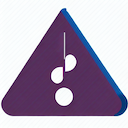

# Published projects

--

## [**Tab Extractor**](https://ionutsava674.github.io/Tab-Extractor/)

Guitar tabs found on the internet can be difficult for visually impaired individuals to read using screen readers. I wanted to help address this issue and make it easier for these musicians to access tabs. That's why I created 'Tab Extractor,' an iOS app that scans pages for guitar tabs, extracts the information, and stores it in a structured format for easy reading by screen readers.

#### Links

[_Get on the app store_](https://apps.apple.com/app/tab-extractor/id1614273947)

[Visit page](https://ionutsava674.github.io/Tab-Extractor/)

[Go to repo](https://github.com/ionutsava674/Tab-Extractor)

 

## [**Contrast Enhancer**](https://ionutsava674.github.io/ContrastEnhancer/)

Contrast-Enhancer is a windows application, written in C#. It is a tool with which you can take a snapshot of the current screen, and with easy mouse gestures, you can fine tune in real time several parameters of the image contrast.

* Contrast is amplified by diminishing the difference between the current light level, and the dynamic range limits.

* You can change the threshold from which contrast is amplified.

* You can fine tune the factor of amplification.

####Links

[_Visit page_](https://ionutsava674.github.io/ContrastEnhancer/)

[_Go to repo_](https://github.com/ionutsava674/ContrastEnhancer)

 

### [**4. Intervals**](https://ionutsava674.github.io/intervals/)

Intervals is an interactive musical game, built for iOS, to test and train the ear to recognize musical scales. The app plays two different notes, and you have to guess the relative distance. An easy app, built around AVFoundation. Fun to built and fun to use.

[View on the AppStore](https://apps.apple.com/in/app/intervals-zone/id1669574204)

[Go to repo](https://github.com/ionutsava674/intervals)

 

## [**Friendly Hold'em**](https://ionutsava674.github.io/Friendly-Holdem-for-mac/)

The very popular game of Texas Hold'em Poker.

Written for the SwiftUI framework, the app utilizes GameKit to provide a seamless gaming experience.

 

* macOS and iOS targets.
* Push Notifications entitlement for turn based match events.

#### Links

[_Download for macOS_](https://github.com/ionutsava674/Friendly-Holdem-for-mac/releases/download/v1.1/FriendlyHoldem.dmg)
V 1.1

[Visit page](https://ionutsava674.github.io/Friendly-Holdem-for-mac/)

[Go to repo](https://github.com/ionutsava674/Friendly-Holdem-for-mac)

 

--

2025

Ionut Sava
