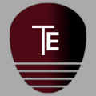
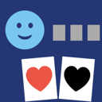
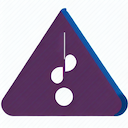

#  Ionut Sava - App portfolio

I am pleased to present my app portfolio, which showcases my experience and expertise in software development.
My name is Ionut Sava, and I am a software developer based in Romania.
I have been developing apps for several years, and my portfolio includes several applications, some of which are available on the AppStore. My apps are designed to solve real-world problems and deliver a great user experience. 

--

## Published apps

 

### [**1. Tab Extractor**](https://ionutsava674.github.io/Tab-Extractor/)

The first app I want to include is one very relevant for me. I didn’t want to write just another demo/sample tutorial app, but instead one that solves real life issues, and with real practicality.

Tab extractor is an IOS app that helps visually impaired guitar players gain access to the contents of guitar tabulatures. It is hard to convey how hard it is to access these using screen readers, but having the ability to easily swipe left and right, while learning a new song, makes a world of difference.

So what the app does is, load a website which the user enters; scans the inner- html content and detects the presence of any guitar tabs. Extracts the information from within, and presents the option to select and save them locally.
So it also acts as a personal library, of songs to learn.

Some mentionable techniques used within the app:
- using webKit to load websites, insert and execute javascript code block. • wrapping UIKit views and controllers in swiftUI view structs.
- running more consuming code in background threads.
- views, navigation stack and sheets.

[View on the AppStore](https://apps.apple.com/app/tab-extractor/id1614273947)

[Source code](https://github.com/ionutsava674/Tab-Extractor)

 

### [**2. Friendly Hold'em**](https://ionutsava674.github.io/Friendly-Holdem-for-mac/)

Yes, not very original. Quite the opposite, probably the most popular card game ot there.

The reason for which i’ve decided to write this app is that, although Tab-Extractor is a real-world stand-on-its-own app, it is quite unsophisticated.

So a multi user interactive app, with reasonably complex states and logic, seemed a good way to go. One important aspect was learning gameKit api and integrating it with the swiftUI framework.
The game is available as macOS notarized app, since gambling content can no longer be submitted by privateindividuals on the AppStore .

- gameKit integration
- Task concurrency, async methods • push notifications
- signing, certificates, notarizing and publishing profiles
- Design patterns
- push notifications
- Multilanguage and localization

[Source code](https://github.com/ionutsava674/Friendly-Holdem-for-mac)

[Visit page](https://ionutsava674.github.io/Friendly-Holdem-for-mac/)

 

### [**3. Contrast Enhancer**](https://ionutsava674.github.io/ContrastEnhancer/)

Initially I wrote this app just for personal use. Not very fancy but very helpful.

It is a windows app written in C#. What it does is allow you to take a screenshot and, using simple mouse gestures, you can fine tune the contrast and zoom of the image, depending on whatever needs to be enhanced. I wrote the first iteration of this app in Delphi for the Win32NT platform, but, the technology being outdated, I’ve refreshed it for the .NET platform, using C#.

[Source code](https://github.com/ionutsava674/ContrastEnhancer)

[Visit page](https://ionutsava674.github.io/ContrastEnhancer/)

 

### [**4. Intervals**](https://ionutsava674.github.io/intervals/)

Intervals Zone is an interactive musical game, built for iOS, to test and train the ear to recognize musical scales. The app plays musical patterns, and users have to identify the relative distance. An easy app, built around AVFoundation.
It is an iOS edutainment app for training musical ear and improving skills - Created the entire project from zero to published product
- Built using AVFoundation

[Source code](https://github.com/ionutsava674/intervals)

[Get on the AppStore](https://apps.apple.com/in/app/intervals-zone/id1669574204)

 

### skills

- Data structures and algorithms
- Languages: swift; C#; Java; C++
- IDEs: xcode; Visual Studio; vs code
- Git version control
- Database: Core Data; SQL
- prior experience with microcontrollers: Atmega AVR architecture, low-level storage & networking, experience with AVR Studio
- DevOps knowledge
- development ability according to Agile/ Waterfall Methodology
- self motivated, self learner and high work ethic
- problem solving, decision making and ability to manage time independently
- flexible and easily adaptable to new situations
- excellent communication skills (in Romanian/ English) with both technical and non-technical peers

### Contact details

To get in touch, you can reach me at
[ionut.sava.8](mailto:ionut.sava.8@gmail.com)

